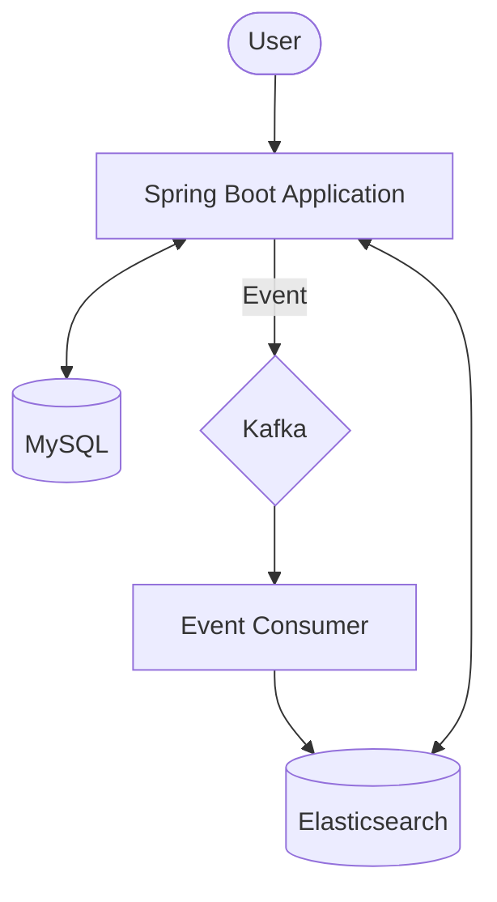

# Perflog (향수 정보 관리 및 검색 서비스)

Perflog는 향수 정보를 관리하고 대용량 데이터를 효율적으로 검색할 수 있는 기능을 제공하는 서비스입니다.  
MySQL과 Elasticsearch 간의 데이터 동기화를 위해 Kafka를 활용한 **이벤트 기반 아키텍처**를 채택하고 있으며, Prometheus와 Grafana를 통해
시스템 메트릭을 모니터링합니다.

---

## 🚀 주요 기능

- **향수 정보 관리**: 향수 등록, 수정, 조회 및 태그 기반 관리.
- **고성능 검색**: Elasticsearch를 활용한 전문(Full-text) 검색 및 필터링.
- **실시간 데이터 동기화**: Kafka를 통해 MySQL의 변경 사항을 Elasticsearch에 즉시 반영.
- **리뷰 및 선호도**: 사용자의 향수 리뷰 작성 및 '좋아요/싫어요' 기반의 선호도 관리.
- **엑셀 데이터 처리**: 향수 데이터를 엑셀로 일괄 업로드 및 다운로드.
- **회원 및 보안**: JWT 기반의 인증 및 인가 시스템.
- **모니터링**: Prometheus와 Grafana를 연동한 애플리케이션 성능 지표 가시화.

---

## 🏗 시스템 아키텍처

Perflog는 안정적인 데이터 처리와 빠른 검색 성능을 위해 다음과 같은 구조를 가집니다.



1. **데이터 저장**: 사용자가 향수 정보를 생성/수정하면 MySQL에 영구 저장됩니다.
2. **이벤트 발행**: 트랜잭션 완료 시 `PerfumeCreatedEvent`가 Kafka 토픽으로 발행됩니다.
3. **이벤트 소비**: Consumer가 메시지를 수신하여 Elasticsearch용 인덱스 문서를 업데이트합니다.
4. **검색**: 검색 요청은 Elasticsearch를 통해 고속으로 처리됩니다.

---

## 🛠 기술 스택

- **언어**: Kotlin 1.9.25
- **프레임워크**: Spring Boot 3.5.4
- **데이터베이스**: MySQL 8.4 (RDB), Elasticsearch 8.11.3 (Search Engine)
- **메시징**: Apache Kafka 7.5.0 (Confluent)
- **보안**: Spring Security, JWT
- **모니터링**: Prometheus, Grafana, Micrometer
- **기타**: Apache POI (Excel Handling)

---

## 📦 실행 방법

### 1. 인프라스트럭처 실행 (Docker Compose)

프로젝트 루트에서 다음 명령어를 실행하여 필수 외부 서비스(MySQL, Elasticsearch, Kafka, Prometheus 등)를 가동합니다.

```bash
docker-compose up -d
```

### 2. 애플리케이션 실행

```bash
./gradlew bootRun
```

---

## 📂 프로젝트 구조

- `src/main/kotlin/com/perflog/config`: 설정 관련 (Kafka, Security, Elasticsearch)
- `src/main/kotlin/com/perflog/domain`: 도메인별 로직 (Member, Perfume, Review, Search, Preference, File)
- `src/main/kotlin/com/perflog/common`: 공통 예외 처리, DTO 및 Base Entity
- `docs/`: 시스템 설계 문서 (`ARCHITECTURE.md`, `CODE_RULES.md`)
