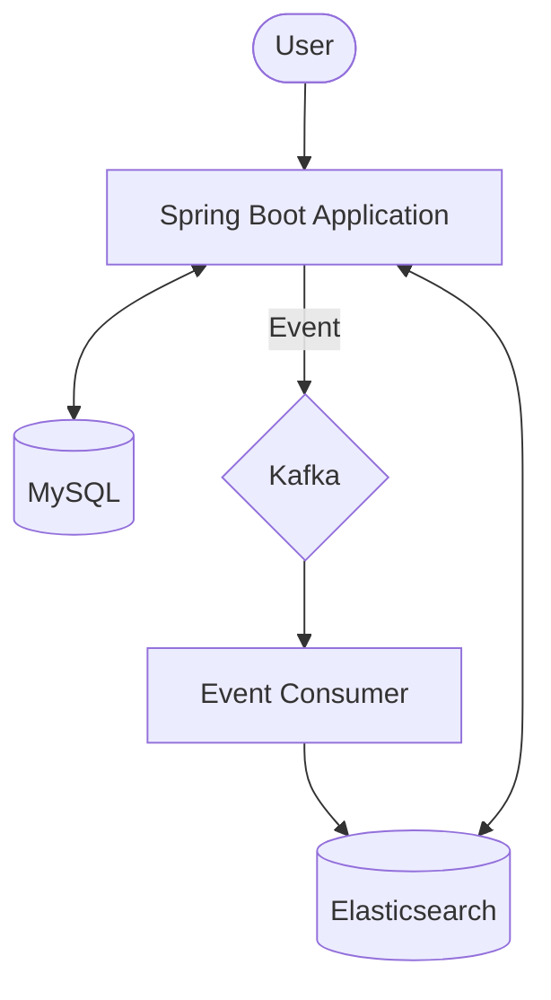

# Perflog 시스템 아키텍처 (ARCHITECTURE.md)

## 1. 개요

Perflog는 향수 정보를 관리하고 검색하는 서비스입니다. 대용량 데이터의 효율적인 검색을 위해 Elasticsearch를 사용하며, MySQL과 Elasticsearch 간의
데이터 동기화를 위해 Kafka를 활용한 이벤트 기반 아키텍처를 채택하고 있습니다.

## 2. 기술 스택

- **언어**: Kotlin 1.9.25
- **프레임워크**: Spring Boot 3.5.4
- **데이터베이스**: MySQL 8.4 (RDB), Elasticsearch 8.11.3 (Search Engine)
- **메시징**: Apache Kafka 7.5.0 (Confluent)
- **보안**: Spring Security, JWT
- **모니터링**: Prometheus, Grafana, Micrometer
- **기타**: Apache POI (Excel)

## 3. 시스템 아키텍처

## 4. 데이터 흐름

1. **데이터 저장**: 사용자가 향수 정보를 생성하면 MySQL에 영구 저장됩니다.
2. **이벤트 발행**: 트랜잭션 내(또는 직후)에 `PerfumeCreatedEvent`가 Kafka의 `perfume-created` 토픽으로 발행됩니다.
3. **이벤트 소비**: `PerfumeEventConsumer`가 메시지를 수신하여 Elasticsearch용 `PerfumeDocument`로 변환 후 인덱싱합니다.
4. **검색**: 사용자의 검색 요청은 Elasticsearch를 통해 고성능으로 처리됩니다.

## 5. 주요 구성 요소

- **Config**: Kafka, Security, ElasticSearch 설정
- **Domain**: Member, Perfume, Review, Search, Preference 등 도메인별 분리
- **Common**: 공통 예외 처리, DTO, 모델 정의
